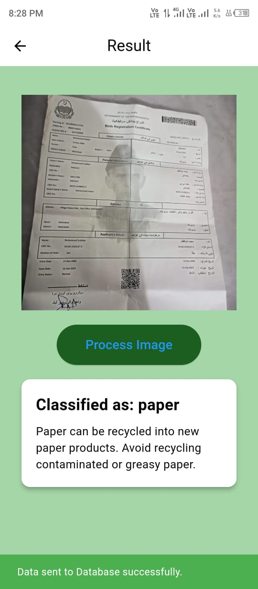

# Flutter AI Garbage Classification App

A Flutter app that integrates artificial intelligence to classify images of garbage into various categories, providing relevant descriptions and suggestions for disposal. The app uses a TensorFlow Lite model for image classification and stores the results in Firebase.

## Table of Contents
- [Features](#features)
- [Screenshots](#screenshots)
- [Installation](#installation)
- [Usage](#usage)
- [AI Model Integration](#ai-model-integration)
- [Configuration](#configuration)
- [Testing](#testing)
- [Contributing](#contributing)
- [License](#license)
- [Credits](#credits)
- [Contact](#contact)

## Features
- Image classification using a pre-trained TensorFlow Lite model.
- Provides descriptions and suggestions for each classified garbage category.
- Stores classification results in Firebase.
- Real-time feedback with loading indicators and status notifications.

## Screenshots 

 
 


## Installation
### Prerequisites
- Flutter SDK
- Dart SDK

### Steps
```bash
git clone https://github.com/zahidprvz/ecosort_app_test.git
cd ecosort_app_test
flutter pub get
flutter run
```

## Usage
1. Launch the app.
2. Take a photo or select an image from your gallery.
3. Click the "Process Image" button to classify the image.
4. View the classification result and its description.
5. The result will be automatically uploaded to Firebase.

## AI Model Integration
### Model Description
The app uses a TensorFlow Lite model trained to classify images of garbage into various categories such as battery, biological, cardboard, etc.

### Setup Instructions
1. Download the TensorFlow Lite model and place it in the `assets` directory.
2. Ensure the `pubspec.yaml` file includes the assets:
   ```yaml
   assets:
     - assets/garbage_classification_model.tflite
     - assets/labels.txt
   ```

## Configuration
1. Configure Firebase for the project:
   - Add your `google-services.json` file for Android.
   - Add your `GoogleService-Info.plist` file for iOS.
2. Update the Firebase rules and settings as necessary.

## Testing
Run the following command to execute tests:
```bash
flutter test
```

## Contributing
We welcome contributions! Follow these steps:
1. Fork the repository.
2. Create a new branch (`git checkout -b feature-branch`).
3. Make your changes and commit them (`git commit -m 'Add new feature'`).
4. Push to the branch (`git push origin feature-branch`).
5. Open a pull request.

## License
This project is licensed under the MIT License. See the [LICENSE](LICENSE) file for details.

## Credits
- [TensorFlow Lite](https://www.tensorflow.org/lite)
- [Firebase](https://firebase.google.com/)
- [Flutter](https://flutter.dev/)

## Contact
For support or inquiries, please email pervaizzahid55@gmail.com.
